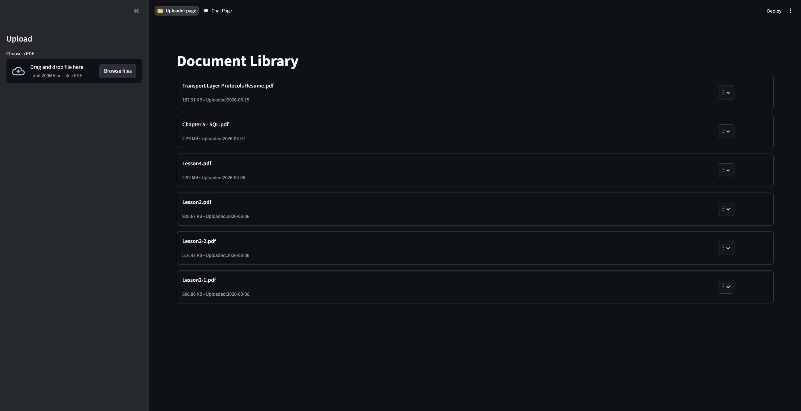
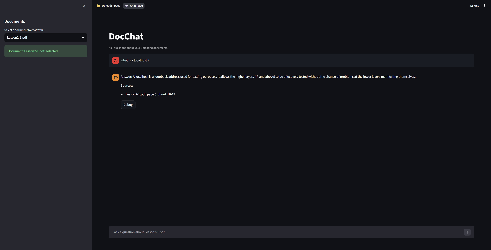
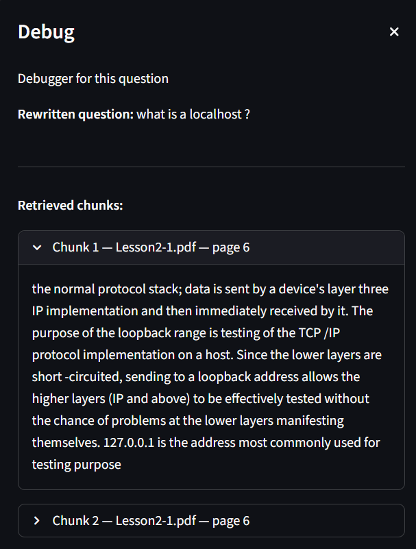

# DocChat — Retrieval-Augmented Document Question Answering System

## Overview

DocChat is a Retrieval-Augmented Generation (RAG) application built with FastAPI, Streamlit, ChromaDB, LangChain, and Ollama.

Users can upload PDF documents, automatically index them into a vector database, and ask natural language questions about their contents. The system retrieves relevant document chunks, rewrites follow-up questions into standalone queries, and generates grounded answers using local language models.

Unlike traditional chatbots that rely solely on model knowledge, DocChat is designed to answer questions using information retrieved from uploaded documents, reducing hallucinations and improving answer reliability.

---

## Screenshots

### Document Library

Upload, view, preview, and manage indexed PDF documents.



### Chat Interface

Ask questions about a selected document and receive grounded answers with citations.



### Retrieval Debugger

Inspect rewritten questions and retrieved chunks to understand why a specific answer was generated.


---

## Why This Project Exists

Many LLM demos follow a simple pattern:

1. Send a prompt
2. Receive a response
3. Display the answer

While useful for experimentation, this approach does not reflect how modern AI applications retrieve and ground information.

This project was built to learn and practice:

* Retrieval-Augmented Generation (RAG)
* Vector databases
* Embedding models
* Semantic search
* Document ingestion pipelines
* Prompt engineering
* FastAPI backend development
* API-driven application architecture
* Local LLM deployment with Ollama

The goal was to move beyond prompt engineering and understand the systems that power document-grounded AI applications.

---

## Project Status

### Current Version: v1

#### Completed

* PDF upload and validation
* Duplicate document detection
* Document indexing pipeline
* ChromaDB integration
* Semantic vector search
* Question rewriting
* Grounded answer generation
* Source citations
* FastAPI backend
* Streamlit frontend
* Retrieval debugging interface

#### In Progress

* Hybrid Search (BM25 + Vector Search)

---

## Architecture

### High-Level Flow

```text
User
 │
 ▼
Streamlit Frontend
 │
 ▼ HTTP
FastAPI Backend
 │
 ├── Document Service
 │
 └── Chat Service
        │
        ▼
 Question Rewriter
        │
        ▼
 Retriever
        │
        ▼
 ChromaDB
        │
        ▼
 Prompt Builder
        │
        ▼
 Ollama LLM
        │
        ▼
 Grounded Answer
```

### Document Processing Flow

```text
PDF Upload
     │
     ▼
PDF Validation
     │
     ▼
PDF Parsing
     │
     ▼
Chunking
     │
     ▼
Embedding Generation
     │
     ▼
ChromaDB Storage
```

---

## Core Components

### 1. Document Upload Service

Handles:

* PDF validation
* Duplicate detection
* File storage
* Metadata tracking

Documents are registered in a local manifest system and assigned a unique document identifier.

---

### 2. Indexing Pipeline

Responsible for:

* Loading PDF documents
* Extracting page content
* Splitting text into chunks
* Creating chunk metadata
* Generating embeddings
* Storing vectors in ChromaDB

Each chunk stores:

* Document ID
* Filename
* Page number
* Chunk index

---

### 3. Question Rewriter

Follow-up questions often lack sufficient context for retrieval.

Example:

**User:** What is DHCP?

**User:** Why is it useful?

Before retrieval:

> Why is it useful?

After rewriting:

> Why is DHCP useful?

This improves retrieval quality and relevance.

---

### 4. Retriever

Performs semantic similarity search using ChromaDB.

Features:

* Document-level filtering
* Top-k retrieval
* Async retrieval pipeline
* Chunk filtering

Only chunks belonging to the selected document are searched.

---

### 5. Prompt Builder

Constructs a grounded prompt using:

* Retrieved document chunks
* Source metadata
* User question

The prompt enforces:

* Context-first answering
* No fabricated information
* Explicit refusal when evidence is insufficient

---

### 6. Answer Generator

Uses a local Ollama model to:

* Consume retrieved context
* Generate grounded responses
* Return supporting citations

The model is instructed to answer only using retrieved evidence.

---

### 7. FastAPI Backend

Provides REST endpoints for:

#### Documents

* Upload document
* List documents
* View document details
* Delete document

#### Chat

* Submit questions
* Retrieve grounded answers

The backend is fully separated from the frontend.

---

### 8. Streamlit Frontend

Provides:

* Document library
* PDF upload interface
* Chat interface
* Retrieval debugging tools

The frontend communicates exclusively through FastAPI endpoints.

---

## Features

* PDF upload and storage
* Automatic document indexing
* ChromaDB vector database
* Semantic search
* Question rewriting
* Retrieval-Augmented Generation (RAG)
* Grounded answer generation
* Source citations
* FastAPI REST API
* Streamlit frontend
* Retrieval debugging interface
* Local LLM execution with Ollama

---

## Tech Stack

### Backend

* FastAPI
* Pydantic
* Python

### RAG Pipeline

* LangChain
* ChromaDB
* Ollama
* EmbeddingGemma

### Frontend

* Streamlit

### Storage

* JSON Manifest Storage
* Local File Storage
* Chroma Vector Database

### AI Models

* embeddinggemma
* llama3.2:3b
* llama2:13b

---

## Project Structure

| Path                  | Purpose                      |
| --------------------- | ---------------------------- |
| `app/api/`            | FastAPI endpoints            |
| `app/services/`       | Business logic               |
| `app/schema/`         | Request and response models  |
| `app/rag/`            | RAG pipeline                 |
| `app/storage/`        | File and vector storage      |
| `app/core/`           | Configuration and exceptions |
| `streamlit/pages/`    | Frontend pages               |
| `streamlit/services/` | API communication            |
| `data/uploads/`       | Uploaded PDFs                |
| `data/chroma/`        | Chroma vector database       |

---

## Local-First AI Stack

This project runs entirely on local infrastructure:

* Local language models via Ollama
* Local embedding generation
* Local ChromaDB vector storage
* No external AI APIs required

This allows experimentation with RAG systems without relying on cloud-based LLM providers.

---

## How To Run

### Prerequisites

* Python 3.10+
* Ollama

Required models:

```bash
ollama pull embeddinggemma
ollama pull llama3.2:3b
ollama pull llama2:13b
```

### 1. Clone Repository

```bash
git clone <your-repository-url>
cd docchat
```

### 2. Install Dependencies

```bash
pip install -r requirements.txt
```

### 3. Start Ollama

```bash
ollama serve
```

### 4. Run FastAPI

```bash
uvicorn app.main:app --reload
```

### 5. Run Streamlit

```bash
streamlit run App.py
```

---

## Lessons Learned

During this project I learned:

* How vector databases store and retrieve embeddings
* The impact of chunk size and overlap on retrieval quality
* How question rewriting improves follow-up question retrieval
* How grounding prompts reduces hallucinations
* How to structure FastAPI applications using routers, services, and schemas
* How to separate frontend and backend responsibilities through APIs
* Common challenges in RAG systems, including retrieval quality and context limitations
* The importance of observability and debugging tools when evaluating retrieval results

---

## Future Improvements

### Retrieval Improvements

* Hybrid Search (BM25 + Vector Search)
* Cross-Encoder Reranking
* Query Expansion

### Application Improvements

* PostgreSQL metadata storage
* User authentication
* Multi-document chat
* Conversation persistence
* Streaming responses

### Deployment Improvements

* Docker support
* CI/CD pipeline
* Cloud deployment

---

## What This Project Demonstrates

* Retrieval-Augmented Generation (RAG)
* FastAPI API Design
* Vector Database Integration
* LangChain Pipelines
* Semantic Search
* Local LLM Deployment
* Prompt Engineering
* Frontend / Backend Separation
* AI Application Architecture

DocChat was built as a learning-focused RAG system to explore the core engineering concepts behind modern document-grounded AI applications.
